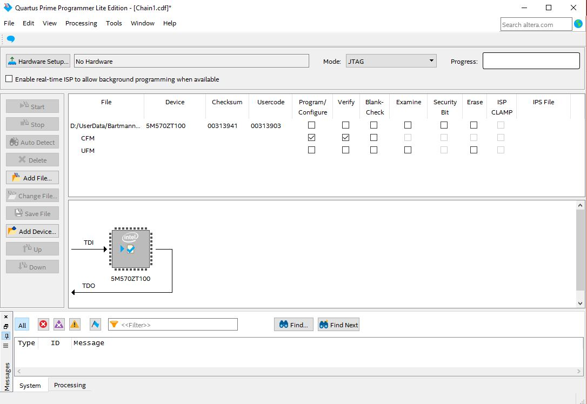

N64RGB (version 2.1)
---

### Table of Contents

- [User Information](https://github.com/borti4938/n64rgb_fw#user-information)
  - [Feature Overview](https://github.com/borti4938/n64rgb_fw#feature-overview)
  - [Controller Functions](https://github.com/borti4938/n64rgb_fw#controller-functions)
  - [Default Configuration / Switchable Functions](https://github.com/borti4938/n64rgb_fw#default-configuration--switchable-functions)
  - [Firmware Update](https://github.com/borti4938/n64rgb_fw#firmware-update)
- [Developer Information](https://github.com/borti4938/n64rgb_fw#developer-information)
  - [Repository Management](https://github.com/borti4938/n64rgb_fw#repository-management)
  - [Setup Toolchain](https://github.com/borti4938/n64rgb_fw#setup-toolchain)
  - [Build Firmware](https://github.com/borti4938/n64rgb_fw#build-firmware)
  - [Outdated Versions](https://github.com/borti4938/n64rgb_fw#outdated-versions)

## User Information

### Features Overview

- Video DAC ADV7125 (or ADV7123)
- Automatic detection of progressive (240p/288p) and interlaced (480i/576i)
- Automatic detection of NTSC and PAL mode
- VI-DeBlur in 240p/288p
  - Horizontal resolution decreased from 640 to 320 pixels removing interpolation pixels in 240p/288p mode and producing a sharper image.
  - Please note that not all games outputting 320x240 at progressive scan mode.
    Some outputting full 640x240 horizontal resolution.
    Therefor having VI-DeBlur enabled decreases image sharpness in that case.
- 16bit color mode
  - Reduces color depth from 21bit (7bit each color) to 16bit (5bit for red and blue and 6bit for green)
  - Some games use the LSBs just for inserting some kind of noise, so the 16bit gives you a clearer image.
- IGR features:
  - reset the console with the controller
  - quick change on VI-DeBlur and 16bit mode with the controller without accessing the menu

### Controller Functions

Three functionalities are implemented: toggle vi-deblur feature and toggle the 16bit mode as well as resetting the console.
They are only availble if the installation allows you to use these functions.
They can be disabled via jumper setting on the modding PCB (see [Jumper Setup description in the PCB repository](https://github.com/borti4938/n64rgb_pcb#jumper-setup)).

The button combination are as follows:
- reset the console: Z + Start + R + A + B
- (de)activate VI-DeBlur:
  - deactivate: Z + Start + R + C-le
  - activate: Z + Start + R + C-ri
- (de)activate 16bit mode:
  - deactivate: Z + Start + R + C-up
  - activate: Z + Start + R + C-dw

If you read here and there the abbriviation IGR, this may translates to either In-Game-Reset or In-Game-Routines.

### Default Configuration / Switchable Functions

Defaults for VI-DeBlur and 16bit are determined via jumper settings on the N64RGBv2.1 mainboard.
As these jumper are read continuously during runtime you can also toggle their state at runtime.
This means a switch soldered to the jumpers allows the user to toggle VI-DeBlur and 16bit mode.
Please see the [PCB repository](https://github.com/borti4938/n64rgb_pcb) for more details on how an installation configuration with switches works.

### Firmware Update

#### Via JTAG

In order to update, you need to have:

- an Altera USB Blaster (or clone) for flashing the firmware
- _Quartus Prime Programmer_ software installed on your computer  
(Programmer software is offered as stand-alone application; so you don't need to have the whole Quartus Prime suite installed.)
- If the programmer driver won't work on your Windows system, please use the following driver: [Link to Terasic.com Wiki](https://www.terasic.com.tw/wiki/Altera_USB_Blaster_Driver_Installation_Instructions).

The update procedure is as follows:
- Download the latest firmware from the [Github Repository](https://github.com/borti4938/n64rgb_fw)
- Start the _Quartus Prime Programmer_ software
- Select the programmer adapter under _Hardware Setup..._ if not automatically selected
- Add the programming file with _Add File..._  
  - Programming file ends with _\*.pof_.
  - Programming file is named after the CPLD - either _n64rgbv2_1_\_**5M240ZT100**.pof_, _n64rgbv2_1_\_**5M57ZT100**.pof_, _n64rgbv2_1_\_**EPM240T100**.pof_ or _n64rgbv2_1_\_**EPM570T100**.pof_
- Check _Program / Configure_ and _Verify_ for your CPLD devices **CFM** which should appear with the previous step.
- Click on _Start_ and wait patiently  
Please note that the **console must be turned on** in order to provide a reference target voltage for the programming device.

Please note that the older N64RGB modding boards, namely N64RGB and N64RGBv2, have programming files supplied in the [discontinued folder](quartus/output_files/discontinued)

## Developer Information

### Repository Management

After cloning the repository, you will find several folders.
Here is a description of what to find where.
Please note that subfolders are not necessarily outlined.

| Folder | Description |
|:-------|:------------|
| **doc** | Documentation related files (e.g. certain pictures) |
| **lib** | Verilog header files |
| **quartus** | Relevant project and revision files for the hardware design |
| **rtl** | Verilog hardware description files |
| **sdc** | SDC (Standard Design Constraints or Synopsys Design Constraints) files |

### Setup Toolchain

The following instruction does not explain how to use the certain tools and/or to manage your personal design flow.
It is meant as a first instruction how to setup the N64Adv development.

These are the software requirements:
- Quartus Prime Lite by intelFPGA (currently version 21.1) with MaxII and MaxV CPLD device support

### Build Firmware

If not already done, clone the GIT source.
Open the [project file](./quartus/n64rgbv2_1.qpf) with Quartus Prime Lite.
Afterwards select the revision you like to work with; a quick switch is located in the middle of the control/symbol bar.
The revision is named after the CPLD you'd like to use / build the firmware for.

There is no need to build any IP-cores as they are not used.
You can directly _Compile Design_ (e.g. using the shortcut Ctrl. + L).
If everything went correct the design should compile just fine (Warnings are ok).

### Outdated Versions

If you want to develop with older PCB revisions, you must switch the repository branch to [discontinue](https://github.com/borti4938/n64rgb_fw/tree/discontinue).
By doing so the project files for the N64RGB (n64rgbv1.qpf) and N64RGBv2 (n64rgbv2.qpf) should appear together with the revision setup files (\*.qsf).
